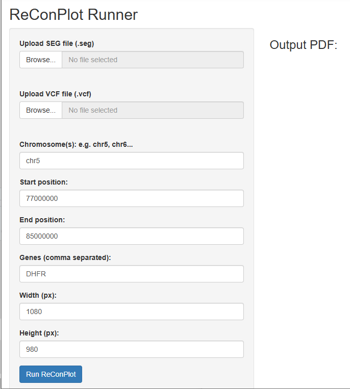

# ReConPlot
R package to visualize complex genomic rearrangements by plotting copy number profiles and structural variants.

If you use ReConPlot please cite our [paper](https://doi.org/10.1093/bioinformatics/btad719)
```
ReConPlot – an R package for the visualization and interpretation of genomic rearrangements
Jose Espejo Valle-Inclán, Isidro Cortés-Ciriano
Bioinformatics, Volume 39, Issue 12, December 2023, btad719, https://doi.org/10.1093/bioinformatics/btad719
```

# Installation
You can clone this repository and install it using the following command in the command line:
```
R CMD INSTALL ReConPlot/
```
Or use devtools to install directly from GitHub within R:
```
> devtools::install_github("cortes-ciriano-lab/ReConPlot")
```
ReConPlot needs a ggplot version >=3.4.0. 

# How to use and examples
Please take a look at the detailed tutorial and documentation of the package for examples and best practices for using ReConPlot to generate publication-quality figures.

## Quick start
First, load the package
```
library(ggplot2)
library(ReConPlot)
```
You will need three data frames:
1. SV data (with columns chr1, pos1, chr2, pos2 and strands (+- notation). You can include single breakends (SBE) or insertions in the dataframe, by setting "chr2" and "pos2" to "." and strands to "SBE"/"INS".
'2. CN data (with columns chr, start, end, copyNumber and minorAlleleCopyNumber)
3. Chromosome selection with genomic region(s) to plot (with columns chr, start, end)
   
Any extra column in the data frames will not be read. 

```
#SV data
print(head(sv_data))

chr1     pos1  chr2     pos2 strands
chr15 25000000 chr15 60000000      ++
chr15 50000000     .        .     INS
chr15 85000000 chr20 10000000      +-
chr20 20000000     .        .     SBE
```

```
#CN data
print(head(cn_data))

chr    start      end copyNumber minorAlleleCopyNumber
chr1        1  9631965          2                     1
chr1  9631966  9631966          3                     1
chr1  9631967 11239516          2                     1
chr1 11239517 11239533          3                     1
chr1 11239534 22578082          2                     1
chr1 22578083 27086500          2                     1
```
```
#Chromosome selection
chrs=c("chr1")
chr_selection = data.frame(
  chr=chrs,
  start=rep(0 ,length(chrs)),
  end=rep (250000000, length(chrs)) 
) 
print(chr_selection)

chr start     end
chr1     0 2.5e+08
```
You can then generate the plot with the ReconPlot function:
```
p = ReConPlot(sv_data,
cn_data,
chr_selection=chr_selection,
legend_SV_types=T,
pos_SVtype_description=1000000,
scale_separation_SV_type_labels=1/23,
title="Example")
print(p)
```
The ReCon plots are ggplot objects and can be modified after generation as such, and they can be easily saved to a PDF file.
In our experience, the following dimensions work well for publication-quality figures and written reports. If using an annotation plot in combination with the ReCon plot, the height might need to be increased.

```
ggsave(filename = "example_ReConPlot.pdf", plot = p, width = 19, height = 5, units = "cm")
```

For advanced usage, please visit the [tutorial](Tutorial/tutorial.pdf).

# Contact
If you have any comments or suggestions please raise an issue or contact us:\
Jose Espejo Valle-Inclan: jespejo@ebi.ac.uk\
Isidro Cortes-Ciriano: icortes@ebi.ac.uk

---

# ReConPlot GUI (v2)
This feature allowed you to use ReConPlot without codes. *2025.11.23*



Prerequisites :
1. [R](https://cran.r-project.org/) 
2. [Rtools](https://cran.r-project.org/bin/windows/) (only for Windows users)
3. [Rstudio](https://posit.co/downloads/)

To start ReConPlot GUI:
1. In the root folder of ReConPlot, right click the icon of `GO_ReConPlotGUI.r`. Choose Open With RStudio.
2. Once you open it with RStudio. Hit the <span style="color: green;">green arrow</span> button "Run App" or "Run Shiny App"

NOTE 1: For first-time users, this app will start to install required packages. It may take 20 min.

NOTE 2: When it prompts `Update all/some/none? [a/s/n]:` type `a` followed by `Enter` to continue.

NOTE 3: Sometimes, a dialog prompts asking your permission to update packages. Hit *Yes* to continue.

NOTE 4: You may encounter errors when installing `VariantAnnotation`. This is caused by mmissing some of the compiled packages in the first round of installation. Simply hit <span style="color: green;">green arrow</span> to rerun again. It should solve the issue.

7. Once all the packages are installed, this App will open in a brower. If it doesn't, open your browser and enter to local host http://127.0.0.1:7858

8. In the App, you need to provide your copy number segment files (with suffix `.called.seg`) and structural variant VCF files (with suffix `.somatic.vcf` ) (refer `test` folder for you testing). Change interested locus and size of output PDF  as you like, then hit Run ReConPlot. You can click download the pdf to get your result.

Some Ubuntu user may need to install additional lib to install `VariantAnnotation`.
```
sudo apt-get install libpng-dev
brew install libconfig
sudo apt-get install libcurl4-openssl-dev
```

